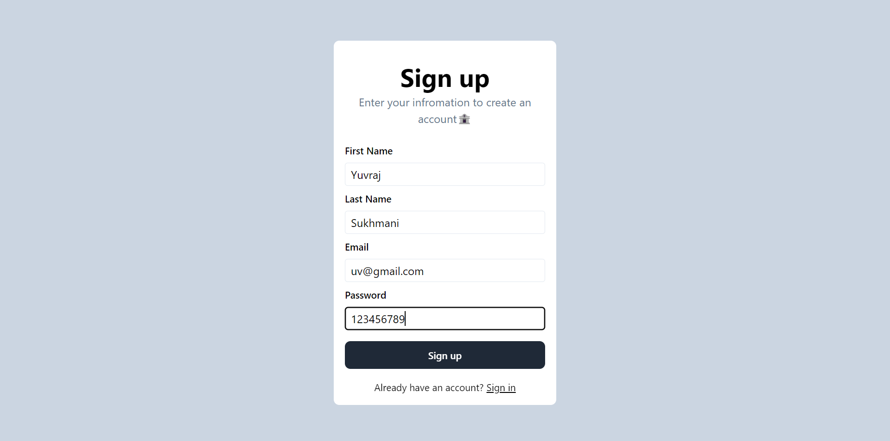
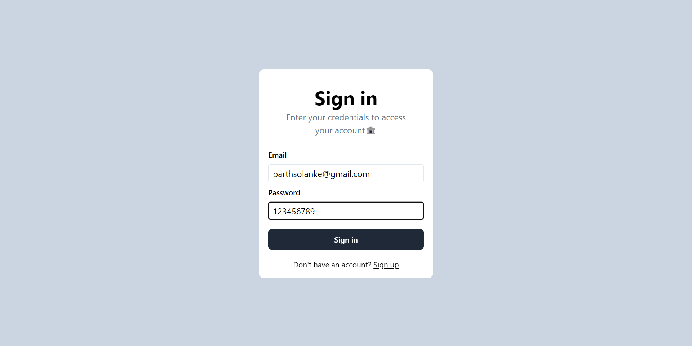
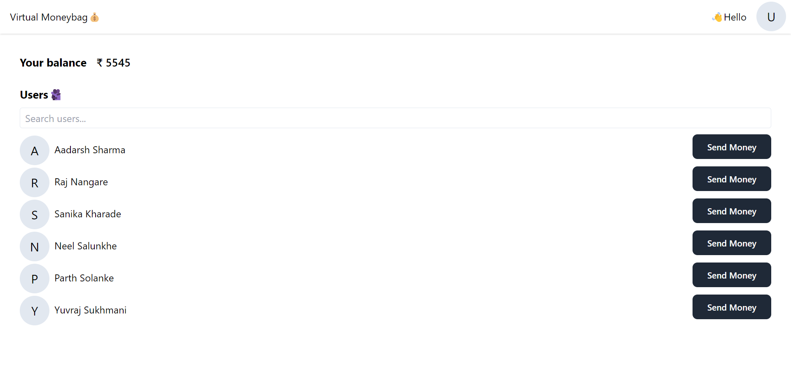
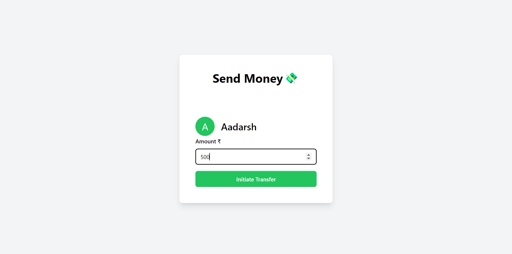
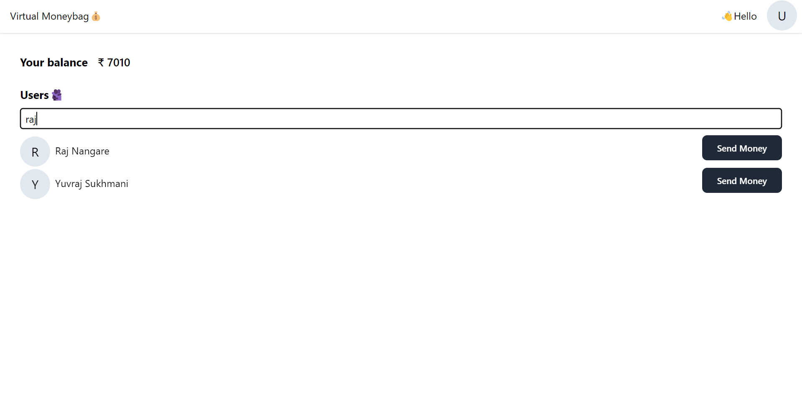

# Virtual Moneybag
Digital wallet 💰

This repository contains both the frontend and backend code for a digital wallet system. Explore the features of the app, including signup, signin, filter search, and money transfer, etc.

## Features

### 1. Signup


- **Description:** Users can create a new account by providing their email, password, first name, and last name.
  
### 2. Signin


- **Description:** Existing users can log in to their accounts by entering their email and password.

### 3. Dashboard


- **Description:** The Dashboard provides an overview of the user's digital wallet, displaying essential information and features related to their account.

### 4. SendMoney



- **Description:** Users can send money to others by specifying the recipient and the amount to be transferred.

### 5. Filter Search


- **Description:** Users can search for other users based on filters such as first name, last name, or username.

## Local Setup Instructions

To set up the application locally, follow these instructions:

1. **Clone the Repository:**
   ```bash
   git clone https://github.com/parthsolanke/virtual-moneybag
   cd virtual-moneybag
   ```

2. **Set MongoDB Password as Environment Variable:**
   ```bash
   export MONGO_PW="Your-Password"
   ```

3. **Install Backend Dependencies:**
   ```bash
   cd backend
   npm install
   ```

4. **Run Backend Server:**
   ```bash
   node index.js
   ```

5. **Install Frontend Dependencies:**
   ```bash
   cd ../frontend
   npm install
   ```

6. **Run Frontend Development Server:**
   ```bash
   npm run dev
   ```

   The application will be accessible at [http://localhost:5173/signup](http://localhost:5173/signup).