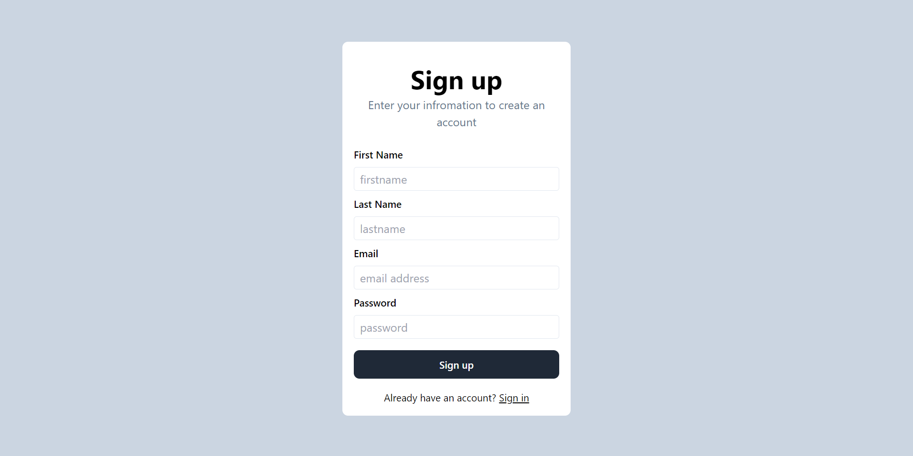
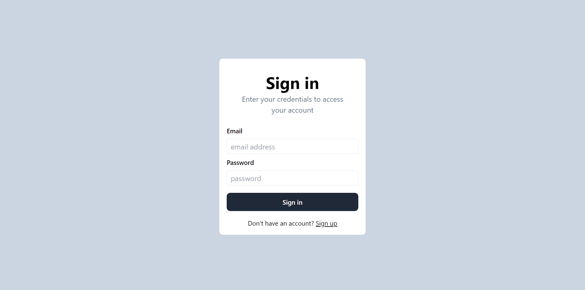
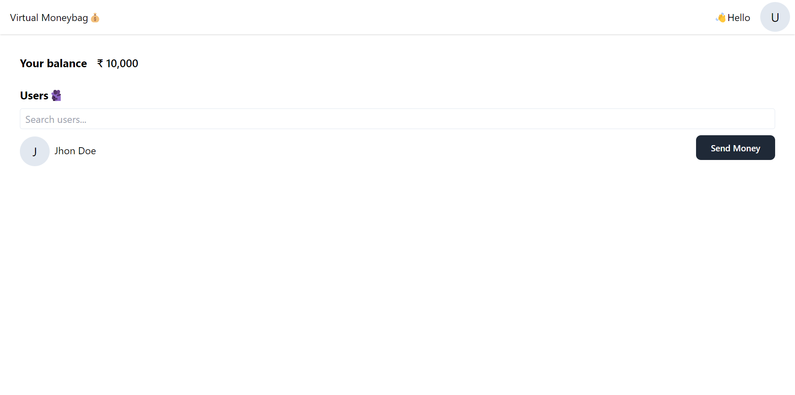
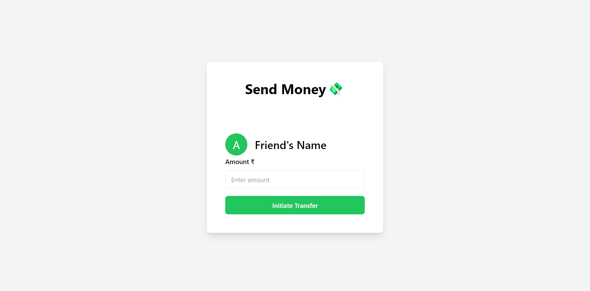

# Digital Wallet Frontend Documentation

This repository contains the frontend code for interacting with the Digital Wallet API. Below are details for the frontend application, including screenshots of key pages.

## Screenshots

### 1. Signup Page

- Description: The Signup page allows users to create a new account by providing their email, password, first name, and last name.

---

### 2. Signin Page

- Description: The Signin page enables users to log in to their accounts by entering their email and password.

---

### 3. Dashboard Page

- Description: The Dashboard page displays essential information and features related to the user's digital wallet.

---

### 4. SendMoney Page

- Description: The SendMoney page allows users to send money to others by specifying the recipient and the amount to be transferred.